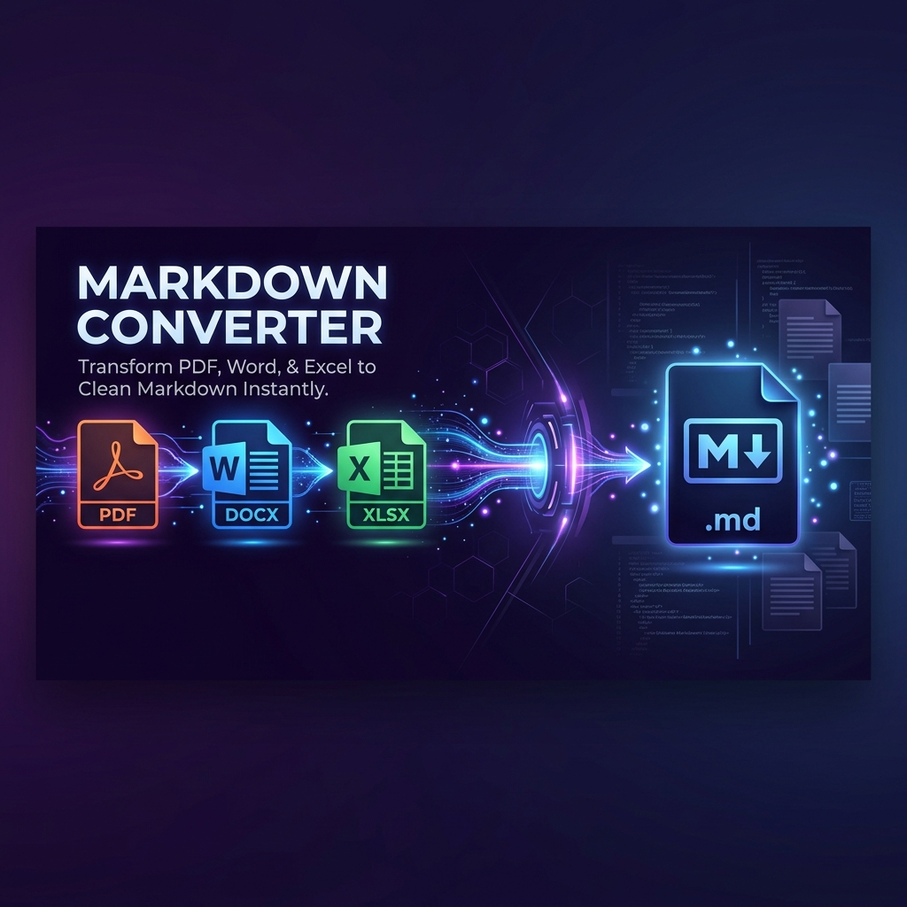

<div align="center">

# 🚀 Markdown Converter

**Ubah dokumen apa pun menjadi Markdown yang bersih — dalam hitungan detik.**

[](https://markitdown.my.id)
[](https://python.org)
[](https://fastapi.tiangolo.com)
[](https://docker.com)
[](LICENSE)

<br/>

> Powered by Microsoft's open-source [**MarkItDown**](https://github.com/microsoft/markitdown) library —
> the same engine trusted by Microsoft to handle 20+ document formats.

<br/>



</div>

---

## ✨ Fitur Unggulan

<table>
<tr>
<td width="50%">

### 📂 Konversi Dokumen
- **PDF, DOCX, PPTX, XLSX** → Markdown
- **HTML, CSV, XML, JSON** → Markdown
- **EPUB** (format eBook)
- **JPG, JPEG, PNG** (opsional OCR via LLM Vision)
- **WAV, MP3** (transkripsi audio)
- **ZIP** (ekstraksi & konversi batch)
- **MSG** (email Outlook)

</td>
<td width="50%">

### ⚡ Produktivitas
- 🔗 **Konversi URL** — tempel URL halaman web mana pun
- 📚 **Batch Convert** — hingga **10 file** sekaligus (50MB/file)
- ✏️ **Live Preview Editor** — split-pane edit Markdown + render HTML
- 📋 **Copy ke Clipboard** — satu klik salin
- 💾 **Download .md** — simpan hasil sebagai file Markdown
- 📦 **Batch Download ZIP** — unduh semua hasil sekaligus
- 🕑 **Riwayat Konversi** — 20 riwayat terakhir tersimpan di lokal

</td>
</tr>
<tr>
<td width="50%">

### 🎨 Tampilan & UX
- 🌙 **Dark / Light Theme** — persisten via `localStorage`
- 🌍 **Multi-bahasa** — 🇺🇸 EN · 🇮🇩 ID · 🇯🇵 JA · 🇸🇦 AR · 🇨🇳 ZH
- 📱 **Fully Mobile-Friendly** — responsif di semua ukuran layar
- 🎭 **Glassmorphic UI** — desain premium modern SaaS
- 🖱️ **Drag & Drop** — unggah file semudah mungkin

</td>
<td width="50%">

### 🔒 Keamanan & Privasi
- 🛡️ **Rate Limiting** — 30 req / 60 detik per IP
- ⏱️ **Timeout Otomatis** — konversi URL maks 30 detik
- 🔐 **Zero Storage** — file diproses di memori, tidak pernah disimpan ke disk
- 🤖 **AI-crawler Friendly** — `robots.txt`, `llms.txt`, `ai.txt`, JSON-LD Schema
- 🔍 **SEO Optimal** — meta OG, Twitter Card, sitemap, canonical URL

</td>
</tr>
</table>

---

## 🚀 Quick Start

### Menggunakan Docker (Direkomendasikan)

```bash
# Clone repositori
git clone https://github.com/your-username/markdownconverter.git
cd markdownconverter

# Build & jalankan dengan Docker Compose
docker-compose up --build

# Buka di browser
open http://localhost:8000
```

### Tanpa Docker (Development)

```bash
# Clone repositori
git clone https://github.com/your-username/markdownconverter.git
cd markdownconverter

# Buat virtual environment & install dependensi
python -m venv .venv
.venv\Scripts\activate          # Windows
# source .venv/bin/activate     # macOS/Linux

pip install -e ".[all]"
pip install fastapi uvicorn python-multipart slowapi

# Jalankan server
uvicorn backend.app:app --reload --port 8000

# Buka di browser
open http://localhost:8000
```

---

## 🗂️ Struktur Proyek

```
markdownconverter/
├── backend/
│   ├── app.py              # FastAPI app — routing & middleware
│   ├── converter.py        # MarkItDown conversion logic
│   └── utils.py            # Helper utilities
├── frontend/
│   ├── index.html          # Halaman utama (SPA)
│   ├── css/style.css       # Glassmorphic premium styling
│   ├── js/
│   │   ├── app.js          # Application logic
│   │   └── i18n.js         # Multi-language translations
│   ├── img/                # OG banner, favicon, icon
│   ├── robots.txt          # Crawler directives
│   ├── sitemap.xml         # XML sitemap
│   ├── llms.txt            # LLM context file (llms.txt standard)
│   └── ai.txt              # AI crawler permissions
├── tests/                  # Pytest backend test suite (29 tests)
├── docs/                   # Dokumentasi pengembangan
├── Dockerfile
├── docker-compose.yml
└── render.yaml             # Render.com deployment config
```

---

## 🔌 API Endpoints

| Method | Endpoint | Deskripsi |
|--------|----------|-----------|
| `POST` | `/api/convert/file` | Upload file untuk dikonversi (`multipart/form-data`, field: `files`) |
| `POST` | `/api/convert/url` | Konversi URL ke Markdown (`{"url": "..."}`) |
| `POST` | `/api/convert/download-zip` | Download semua hasil sebagai ZIP (`{"files": [...]}`) |
| `GET` | `/api/health` | Health check + daftar converter yang terdaftar |
| `GET` | `/docs` | Swagger UI — dokumentasi API interaktif |
| `GET` | `/robots.txt` | Crawler permission directives |
| `GET` | `/sitemap.xml` | XML sitemap |
| `GET` | `/llms.txt` | LLM-readable context file |
| `GET` | `/ai.txt` | AI crawler permissions |

### Contoh Request

```bash
# Konversi file PDF
curl -X POST http://localhost:8000/api/convert/file \
  -F "files=@document.pdf"

# Konversi URL
curl -X POST http://localhost:8000/api/convert/url \
  -H "Content-Type: application/json" \
  -d '{"url": "https://example.com/article"}'
```

---

## 🛠️ Tech Stack

| Layer | Teknologi |
|-------|-----------|
| **Backend** | Python 3.12, FastAPI, Uvicorn |
| **Konversi** | [MarkItDown](https://github.com/microsoft/markitdown) `[all]` — 20+ converter |
| **Frontend** | Vanilla HTML5, CSS3, JavaScript (ES6+) |
| **Markdown Render** | [marked.js](https://marked.js.org/) |
| **Styling** | Google Fonts (Inter + Fira Code), Glassmorphism CSS |
| **Infrastruktur** | Docker, Docker Compose |
| **Deployment** | Render.com (staging), custom domain `markitdown.my.id` |
| **SEO/AIO** | JSON-LD Schema, Open Graph, Twitter Card, llms.txt |

---

## ☁️ Deployment

| Lingkungan | Host | Cara |
|------------|------|------|
| **Local** | `localhost:8000` | `docker-compose up --build` |
| **Staging** | Render.com | Auto-deploy dari GitHub (Docker) |
| **Production** | `markitdown.my.id` | Custom domain via Render |

Lihat [`render.yaml`](render.yaml) untuk konfigurasi deployment otomatis.

---

## 🧪 Testing

```bash
# Jalankan seluruh test suite (29 tests)
pytest tests/ -v

# Dengan coverage report
pytest tests/ --cov=backend --cov-report=term-missing
```

---

## 🌐 SEO & AI Optimization

Markdown Converter dibangun dengan optimasi penuh untuk mesin pencari dan AI:

- **Structured Data** — JSON-LD Schema (`WebApplication`, `FAQPage`, `BreadcrumbList`)
- **Social Preview** — Open Graph & Twitter Card meta tags
- **AI Crawlers** — `robots.txt` mengizinkan `GPTBot`, `ClaudeBot`, `Google-Extended`, `PerplexityBot`, dll.
- **llms.txt** — Mengikuti standar [llms.txt](https://llmstxt.org/) untuk konteks LLM
- **Sitemap** — XML sitemap terindeks di `https://markitdown.my.id/sitemap.xml`

---

## 📄 Lisensi

Proyek ini dilisensikan di bawah **GNU General Public License v3 (GPL v3)** — bebas digunakan, dimodifikasi, dan didistribusikan.

MarkItDown library oleh Microsoft dilisensikan di bawah MIT License terpisah. Lihat [microsoft/markitdown](https://github.com/microsoft/markitdown).

---

<div align="center">

Made with ❤️ by [**alfajri**](https://alfajri.my.id/) &nbsp;·&nbsp; Powered by [MarkItDown](https://github.com/microsoft/markitdown) from Microsoft

</div>
