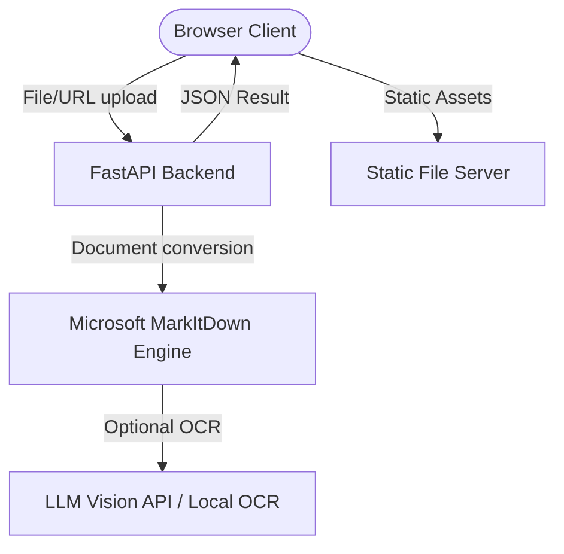

# Architecture Documentation

This document describes the high-level software architecture of **Markdown Converter**.

## System Overview

Markdown Converter is a lightweight, responsive single-page web utility (SPA) that converts documents into Markdown. It utilizes a Python FastAPI backend acting as a wrapper around Microsoft's open-source `markitdown` library and a vanilla HTML5/CSS3/JavaScript frontend.



---

## Directory Structure

```
markdownconverter/
├── backend/
│   ├── app.py                # FastAPI Main Application & Routing
│   ├── convert.py            # API Route Handlers (File, URL, ZIP)
│   └── deps.py               # Dependency Injection (MarkItDown engine init)
├── frontend/
│   ├── css/
│   │   └── style.css         # Custom Responsive Design CSS
│   ├── js/
│   │   ├── app.js            # Main JS Application logic
│   │   └── i18n.js           # Multi-language (i18n) translation tables
│   ├── img/                  # Favicons and Open Graph images
│   ├── index.html            # Main page with SPA interface & SEO Fallbacks
│   ├── robots.txt            # Search & AI indexer instructions
│   ├── sitemap.xml           # XML Sitemap
│   ├── llms.txt              # LLM-specific details file
│   └── ai.txt                # AI crawlers permission policy
├── docs/                     # Project technical documentation
└── tests/                    # Backend Pytest test suites
```

---

## Key Modules & Flow

### 1. Frontend SPA
- Core interface is defined in `frontend/index.html`.
- State, UI interactions, drag-and-drop, history, and AJAX requests are managed by `frontend/js/app.js`.
- Localization translations are loaded and applied dynamically using `frontend/js/i18n.js`.
- Dynamic `<html lang="...">` adjustments synchronise the selected language tag directly to the DOM to optimize SEO indexing for different locales.

### 2. Backend API (`backend/app.py` & `backend/convert.py`)
- **Rate Limiting**: Custom middleware limits requests to 30 requests/60 seconds per IP.
- **Conversion Engine**: Initializes the `MarkItDown` Python engine with support for PDF, Word, Excel, PowerPoint, HTML, EPUB, etc.
- **Static SEO Routes**: Specific root routes serve static crawler configurations direct from `/robots.txt`, `/sitemap.xml`, `/llms.txt`, and `/ai.txt` with correct MIME types to comply with crawler requirements.
